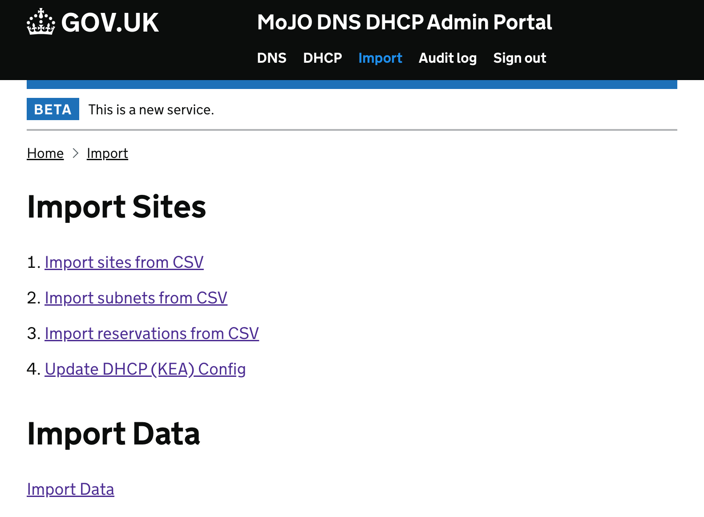
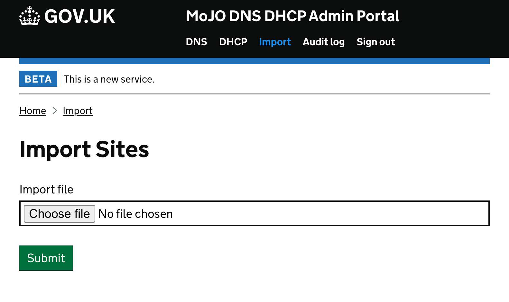
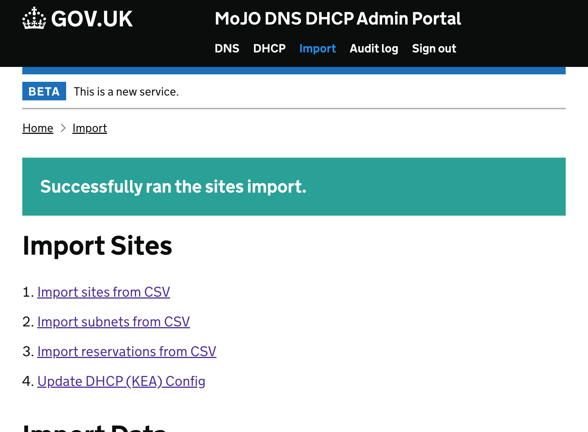
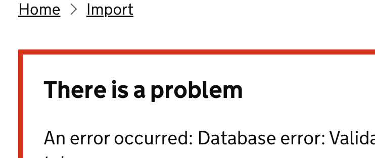

# Site Import from CSV

The DHCP Admin has a new function that enables bulk creation of new Sites, Subnets and Reservations from CSV file.

## Overview

Due to the relationship between Sites, Subnets and Reservations each type needs to be imported in order.
A Site needs to exist in the system before the Subnets can be added, likewise Subnet needs to exist before a Reservation can be created. 

A spread sheet with three sheets is required or three CSV files can be edited.

[Sites](./csv/Sites.csv)
```csv
name,fits_id,windows_opt
```

[Subnets](./csv/Subnets.csv)
```csv
fits_id,cidr_block,start_address,end_address,routers
```

[Reservations](./csv/Reservations.csv)
```csv
fits_id,cidr_block,hw_address,ip_address,hostname,description
```

A set of examples which can be used to demonstrate are in the folder [dhcp_csv_example](./dhcp_csv_example)

### Import

On the top navigation there is an item named "Import", click that and a page will show with two sections.

- Import Sites
    1. Import sites from CSV
    2. Import subnets from CSV
    3. Import reservations from CSV
    4. Update DHCP (KEA) Config
- Import Data
    - Import Data

The first section has the links to the forms to upload the new sites, subnets and reservations; and trigger an update of dhcp (KEA) config.



The second section links to form used for the [data cut over](docs/cutover_data_checks.md) which is described in that page and not covered in this page.

#### Import Sites

The form for each upload is very simple, just an upload form with a submit button, once submitted the DHCP Admin will start checking the import data and creating the new resources, if successful a message will show.



Simple procedure provided the CSV files have been prepared carefully.



(_should there be an issue with any item in the CSV all the changes will not be applied and an error message will be displayed_).




Import in the necessary order of 1 - sites, 2 - subnets & 3 - reservations, then Update DHCP (KEA) Config.

Currently this has not had any load testing so we need to test how many sites we can load in one batch.
